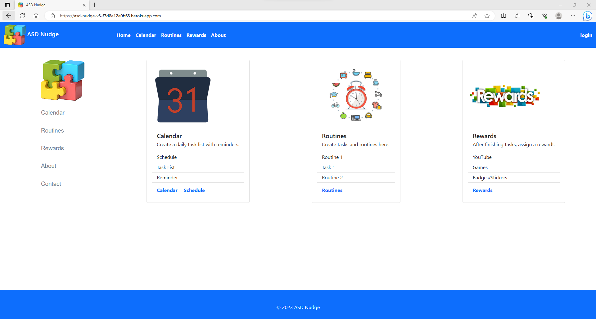
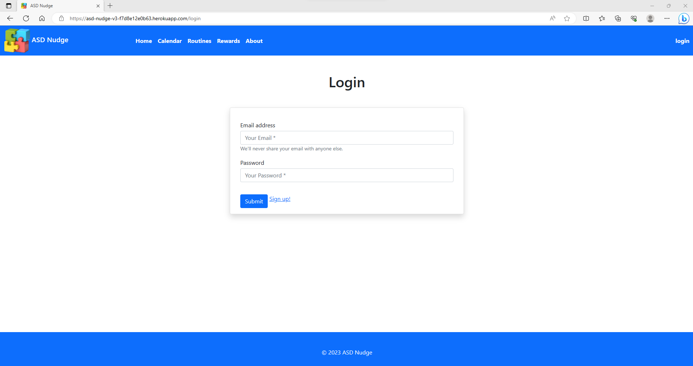
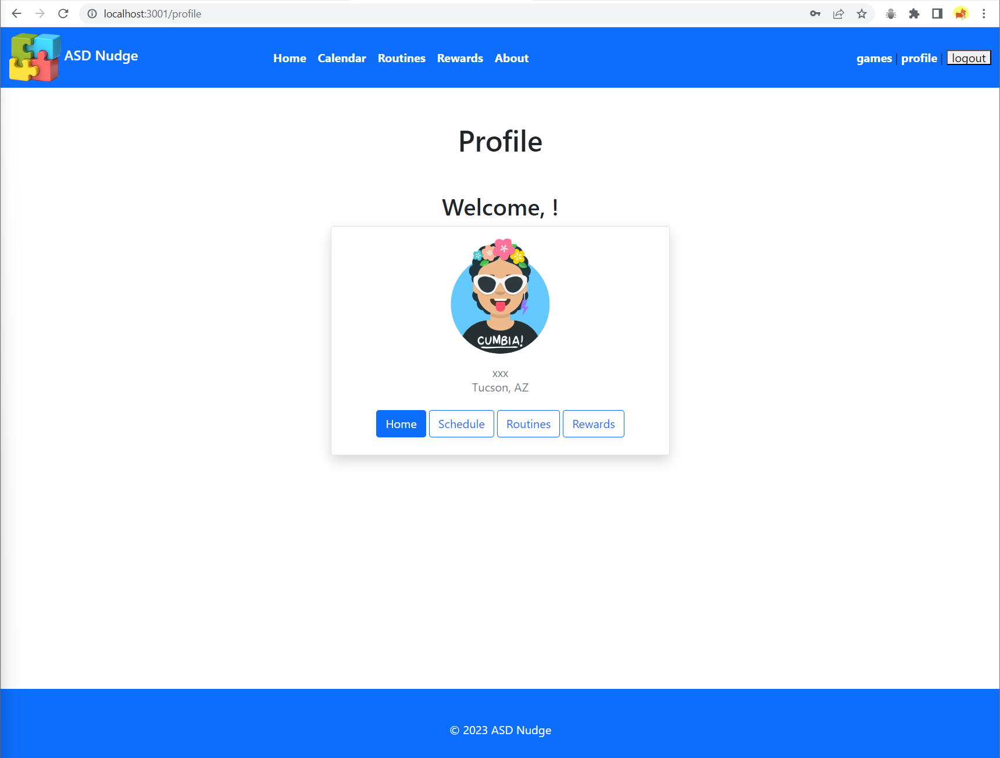

# ASD-Nudge-v3

# User Story: 
Someone with ASD needs help with establishing a routine. This app will help them become
more structured and focused on finishing tasks without issues or problems. The parents or
caregiver can create a schedule to help with everyday tasks like hygiene to finishing homework
or timing out each task.

# Project Description:
We are creating an application to create tasks and routines for people on the Autism Spectrum. It will provide schedules with everyday routines and tasks with images showing what the task is. It will provide rewards for finishing tasks.

Users can create an account to log in
Includes a reward section

# Technologies Used:
CSS
HTML 
Javascript
Node.js
Express.js
MySql
Handlebars

## Homepage

## Log in

## Profile Page

## Links:
https://asd-nudge-v3-f7d8e12e0b63.herokuapp.com/

